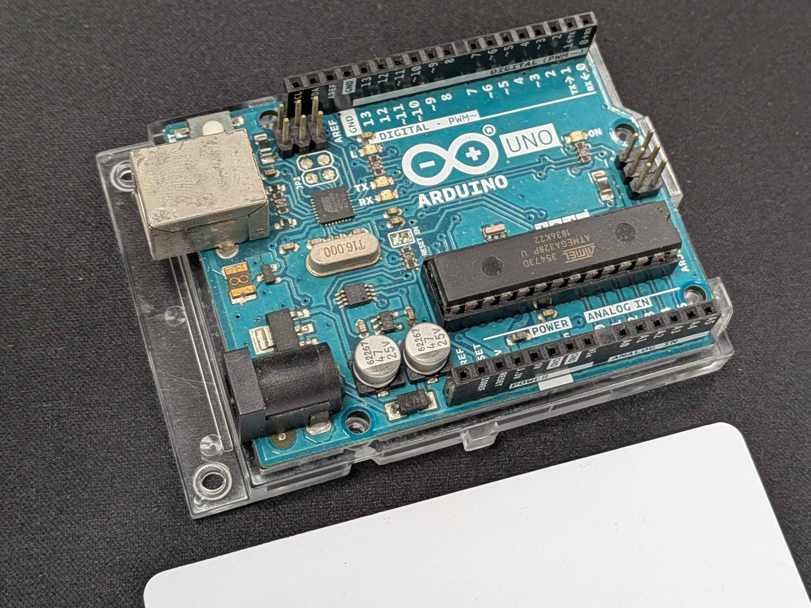
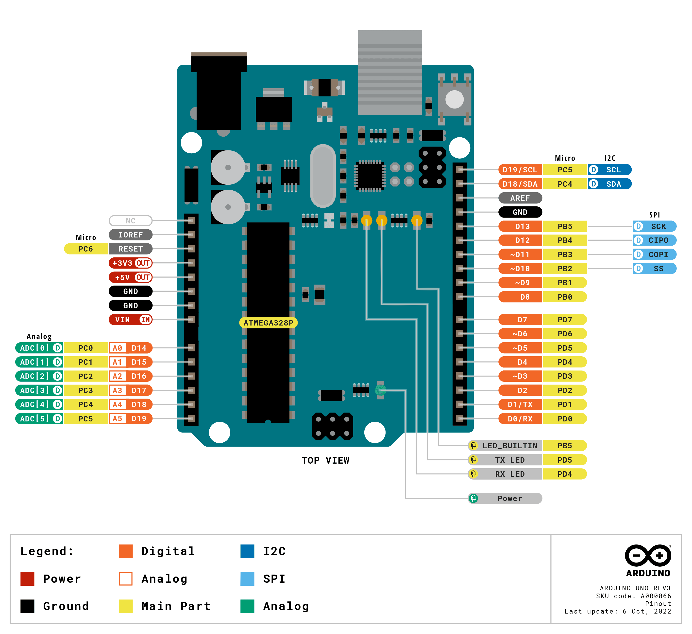
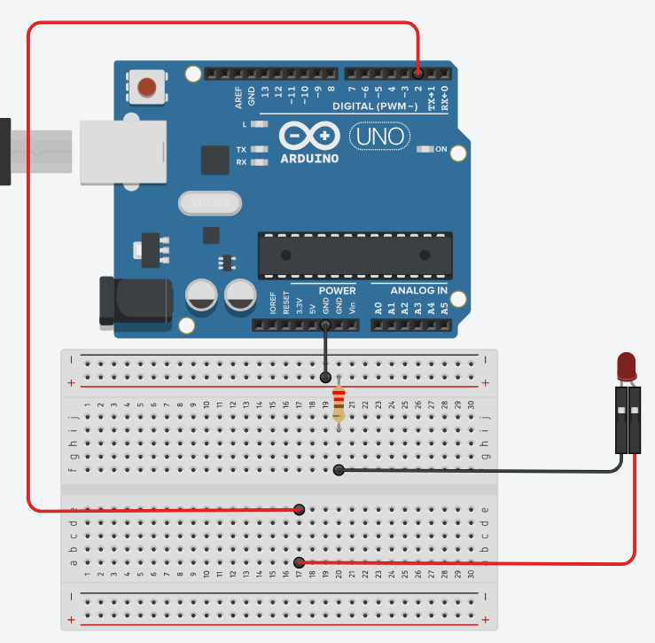
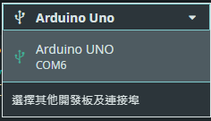

# Arduino Course 
## \#0 Prolouge

---
transition: slide-left
layout: two-cols
---
<h1 style="color: #00878f; font-size: 2.5rem; margin-bottom: 24px; padding-bottom: 10px; font-weight: bold;">
    什麼是 Arduino?
</h1>
<h2>Arduino 是一家義大利公司，以研發與製造 <text style="color: #00878f; background-color: #ffffff; font-weight: bold;">微控制器</text> 開發板著稱，通常也會以 Arduino 指稱最常見的開發板 <text style="color: #00878f; background-color: #ffffff; font-weight: bold;">Arduino UNO</text></h2>
<br>
<h1 style="color: #00878f; font-size: 2rem; margin-bottom: 24px; font-weight: bold;" v-click="1">
    什麼是微控制器? (Microcontroller Unit, MCU)
</h1>
<h2 v-click="2">控制什麼? <text style="color: #00878f; background-color: #ffffff; font-weight: bold;" v-click="3">執行器 (Actuator)</text></h2>
<h2 v-click="4">怎麼控制? <text style="color: #00878f; background-color: #ffffff; font-weight: bold;" v-click="5">程式邏輯</text></h2>
<h2 v-click="6">怎麼互動? <text style="color: #00878f; background-color: #ffffff; font-weight: bold;" v-click="7">感測器 (Sensor)</text></h2>


::right::

<div class="h-full flex flex-col justify-center items-center">
    <div style="width: 100%; max-width: 450px; border-radius: 12px; box-shadow: 0 10px 25px rgba(0,0,0,0.3); overflow: hidden; background: #1e293b;">    
        
        <div class="flex items-center justify-center gap-3 py-4">
            <span class="text-[10px] font-bold text-white bg-[#00878f] px-2 py-1 rounded uppercase tracking-wider">
                Hardware
            </span>
            <span class="text-sm font-semibold text-gray-300 tracking-wide">
                Arduino UNO
            </span>
        </div>
    </div>
</div>

---
transition: slide-left
layout: two-cols
---

<h1 style="color: #00878f; font-size: 2.5rem; margin-bottom: 24px; font-weight: bold;">
    微控制器的作用 (Ⅰ)
</h1>
<h2>手電筒按一下開，再按一下關，但第二次開變成快速閃爍，再次關閉後開啟，又變回長亮</h2>

<br>
<br>

<h2 style="font-size: 2.5rem; font-weight: bold;" v-click="1">如何做到的?</h2>

::right::


---
transition: slide-left
layout: two-cols
layoutClass: gap-x-16
---
<h1 style="color: #00878f; font-size: 2.5rem; margin-bottom: 24px; font-weight: bold;">
    微控制器的作用 (Ⅱ)
</h1>

<h2>手電筒的電路大致長這樣，要如何做到連續閃爍</h2>

<svg xmlns="http://www.w3.org/2000/svg" viewBox="0 0 600 400" width="100%" height="100%" style="margin-top: -80px;">
    <g stroke-width="4" stroke-linecap="round" fill="none">
        <path d="M 100 320 L 100 80 L 275 80" stroke="#ffffff" />
        <path d="M 325 80 L 500 80 L 500 150" stroke="#ffffff" />
        <path d="M 500 230 L 500 320 L 310 320" stroke="#ffffff" />
        <path d="M 290 320 L 100 320" stroke="#ffffff" />
        <circle cx="300" cy="80" r="20" stroke="#ffee03" stroke-width="5" />
        <path d="M 500 230 L 525 165" stroke="#15ff00" stroke-width="7" />
        <path d="M 310 285 L 310 355" stroke="#888888"  stroke-width="7"/>
        <path d="M 290 295 L 290 345" stroke="#888888" stroke-width="7" />
    </g>
</svg>

::right::

<h2 style="margin-top: 80px;" v-click="1">連續閃爍是微控制器中燒錄的程式控制的結果</h2>
<svg xmlns="http://www.w3.org/2000/svg" viewBox="0 0 600 400" width="100%" height="100%" style="margin-top: -80px;" v-click="1">
    <g stroke-width="4" stroke-linecap="round" fill="none">
        <path d="M 100 320 L 100 80 L 275 80" stroke="#ffffff" />
        <path d="M 325 80 L 500 80 L 500 150" stroke="#ffffff" />
        <path d="M 500 230 L 500 320 L 310 320" stroke="#ffffff" />
        <path d="M 290 320 L 100 320" stroke="#ffffff" />
        <circle cx="300" cy="80" r="20" stroke="#ffee03" stroke-width="5" />
        <rect x="450" y="150" width="100" height="80" fill="none" stroke="#15ff00" stroke-width="4" />
        <text x="500" y="190" fill="#ffffff" font-size="10" text-anchor="middle" dominant-baseline="central">
        MCU
        </text>
        <path d="M 310 285 L 310 355" stroke="#888888"  stroke-width="7"/>
        <path d="M 290 295 L 290 345" stroke="#888888" stroke-width="7" />
    </g>
</svg>

---
transition: slide-left
layout: two-cols
layoutClass: gap-x-16
---
<h1 style="color: #00878f; font-size: 2.5rem; margin-bottom: 24px; font-weight: bold;">
    LED 閃爍實作 (Ⅰ)
</h1>
<h2>首先認識 Arduino UNO 開發版腳位
腳位主要分成三類<text v-click="1">，每類中比較常用的是</text>
<ul>
    <li>電源 (Power) <br><text style="color: #00878f; font-size: 1.5rem; font-weight: bold; background-color: #ffffff;" v-click="1">3.3V、5V、GND</text></li>
    <li>類比 (Analog) <br><text style="color: #00878f; font-size: 1.5rem; font-weight: bold; background-color: #ffffff;" v-click="1">A0~A5</text></li>
    <li>數位 (Digital) <text style="color: #00878f; font-size: 2rem; font-weight: bold; background-color: #ffffff;" v-click="1">1 or 0</text><br><text style="color: #00878f; font-size: 1.5rem; font-weight: bold; background-color: #ffffff;" v-click="1">0~13</text></li>
</ul>
</h2>

::right::



---
transition: slide-left
layout: two-cols
layoutClass: gap-x-16
---
<h1 style="color: #00878f; font-size: 2.5rem; margin-bottom: 24px; font-weight: bold;">
    LED 閃爍實作 (Ⅱ)
</h1>
<h2>首先是接線，如幾頁前的電路圖<text  v-click="1">，由於 Arduino 是一塊整合 MCU 的開發版，可以看成這樣</text></h2>
<svg xmlns="http://www.w3.org/2000/svg" viewBox="0 0 600 400" width="100%" height="100%" style="margin-top: -100px;">
    <g stroke-width="4" stroke-linecap="round" fill="none">
        <path d="M 100 320 L 100 80 L 275 80" stroke="#ffffff" />
        <path d="M 325 80 L 500 80 L 500 150" stroke="#ffffff" />
        <path d="M 500 230 L 500 320 L 310 320" stroke="#ffffff" />
        <path d="M 290 320 L 100 320" stroke="#ffffff" />
        <circle cx="300" cy="80" r="20" stroke="#ffee03" stroke-width="5" />
        <rect x="450" y="150" width="100" height="80" fill="none" stroke="#15ff00" stroke-width="4" />
        <text x="500" y="190" fill="#ffffff" font-size="10" text-anchor="middle" dominant-baseline="central">
        MCU
        </text>
        <path d="M 310 285 L 310 355" stroke="#888888"  stroke-width="7"/>
        <path d="M 290 295 L 290 345" stroke="#888888" stroke-width="7" />
        <rect v-click="1" x="50" y="140" width="500" height="120" fill="#00878f" stroke="#00878f" stroke-width="4" />
        <text v-click="1" x="300" y="200" fill="#ffffff" font-size="18" font-family="sans-serif" font-weight="bold" text-anchor="middle" dominant-baseline="central">
            Arduino UNO
        </text>
    </g>
</svg>

::right::

<h2 style="margin-top: 80px;" v-click="2">使用數位腳位操作輸出 (高電位，正極)<br>使用 GND 作為低電位 (負極) </h2>


---
transition: slide-left
layout: two-cols
layoutClass: gap-x-16
---
<h1 style="color: #00878f; font-size: 2.5rem; margin-bottom: 24px; font-weight: bold;">
    LED 閃爍實作 (Ⅲ)
</h1>
<h2>開啟 Arduino IDE → 檔案 → 新增 Sketch</h2>
<br>
<h2>範例程式</h2>

```cpp{lines:true}
void setup()
{
  pinMode(2, OUTPUT);
}

void loop()
{
  digitalWrite(2, HIGH);
  delay(1000);
  digitalWrite(2, LOW);
  delay(1000);
}
```

::right::

<h2 style="margin-top: 50px; font-size: 1.2rem;">pinMode() 是宣告 (Void) 腳位 (Pin) 模式 (Mode) 的函式 (Function)<br>
必須填寫的參數 (Parameter) 有兩個，要設定的目標腳位，以及要設定的模式 INPUT or OUTPUT<br>
digitalWrite() 是指定指定數位腳位輸出的函式<br>
必須填寫的參數有兩個，要設定的腳位，以及輸出的值 HIGH (1) or LOW (0)<br>
delay() 是進行下行程式前暫停指定時間的函式<br>
必須填寫的參數為時間長度 (毫秒)
</h2>

<br>
<h1 style="color: #00878f; font-size: 1.5rem; font-weight: bold;">
    Tips:
</h1>
<text> 這些資訊主要能從<a href="https://docs.arduino.cc/language-reference/">Arduino IDE 文件</a>找到</text>

---
transition: slide-left
layout: two-cols
layoutClass: gap-x-16
---
<h1 style="color: #00878f; font-size: 2.5rem; margin-bottom: 24px; font-weight: bold;">
    LED 閃爍實作 (Ⅳ)
</h1>
<h2>存檔後，先確定是否有接到開發板</h2>

<h2>進行驗證</h2>

<h2>接著上傳 (燒錄)</h2>


::right::

<video autoplay loop style="height: auto; width: auto;" src="./public/course1.mp4"></video>